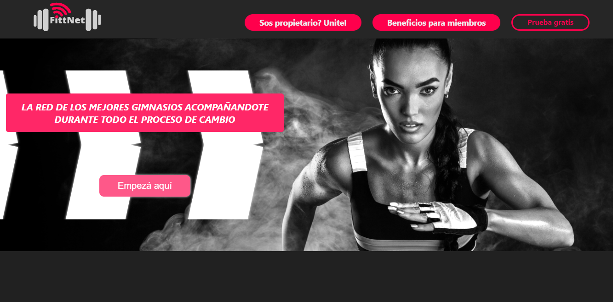
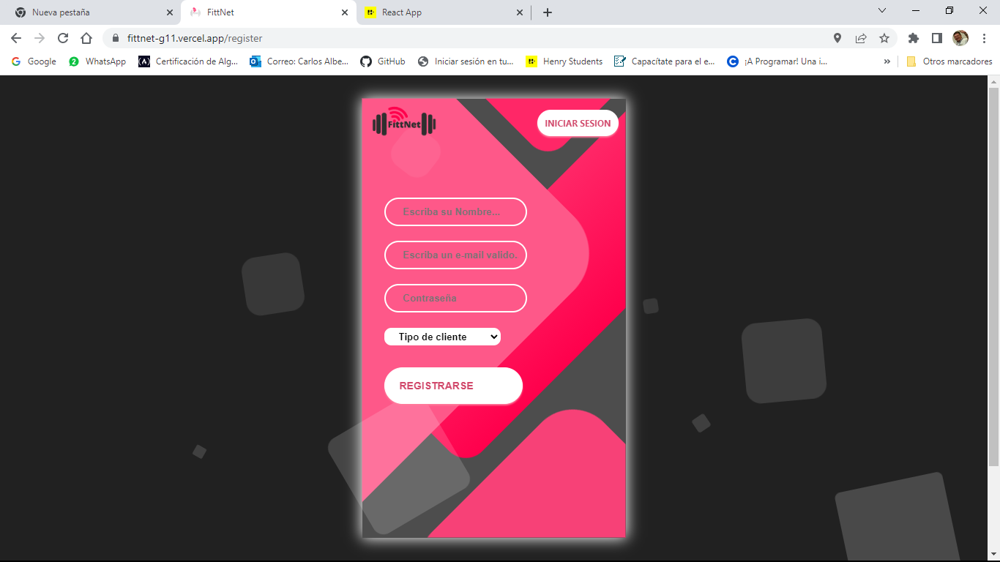
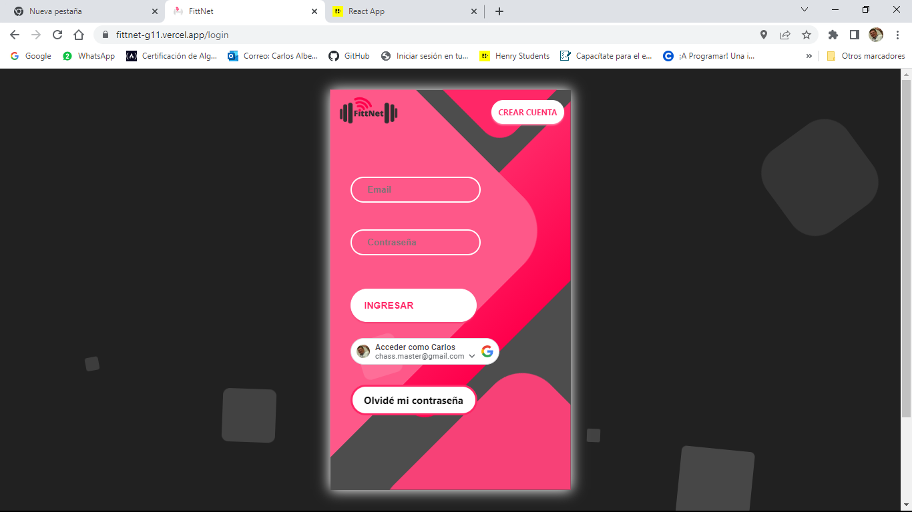
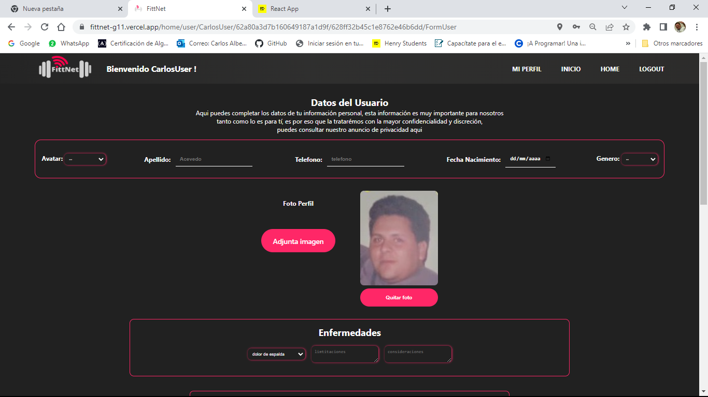
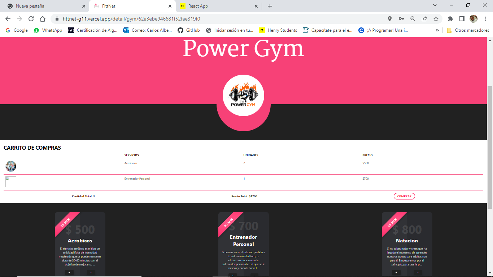
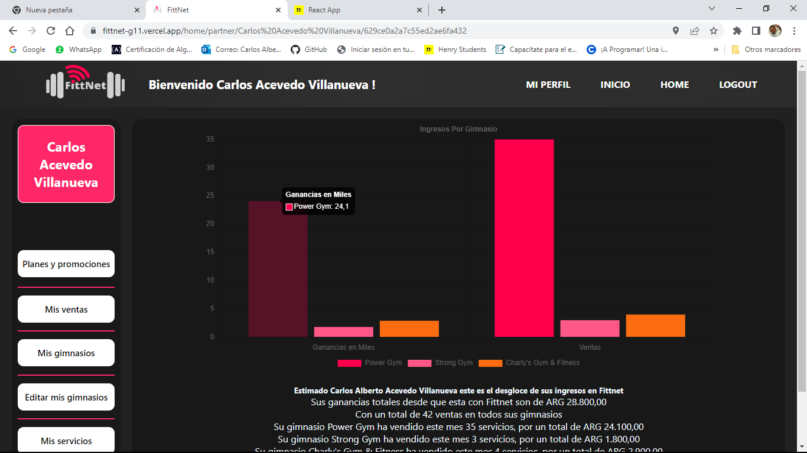
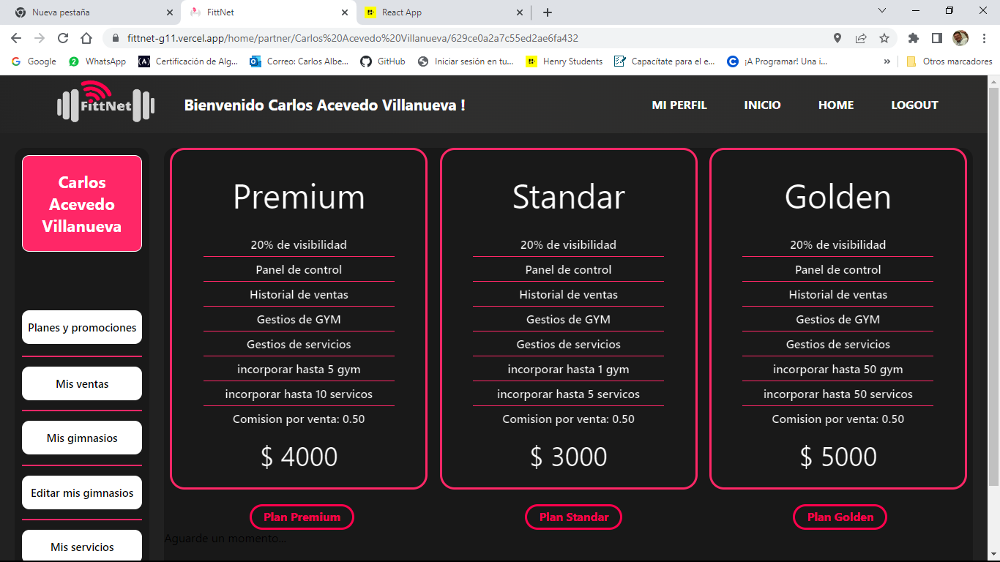
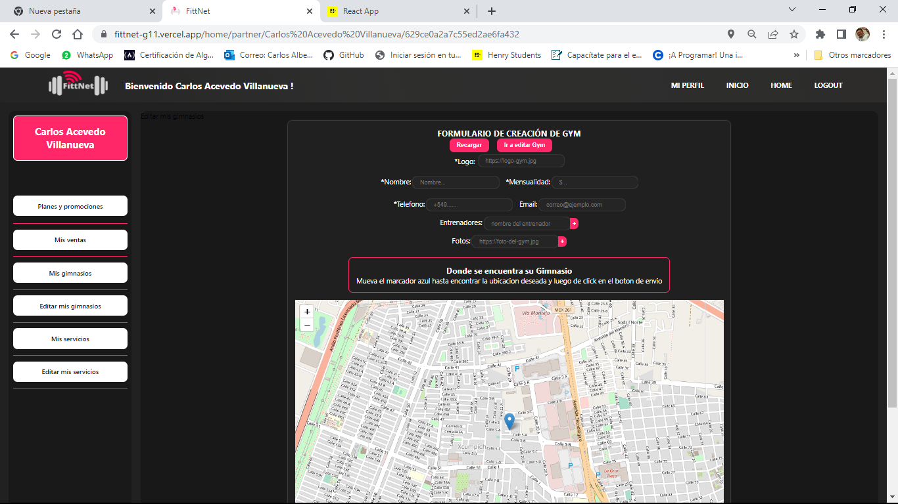
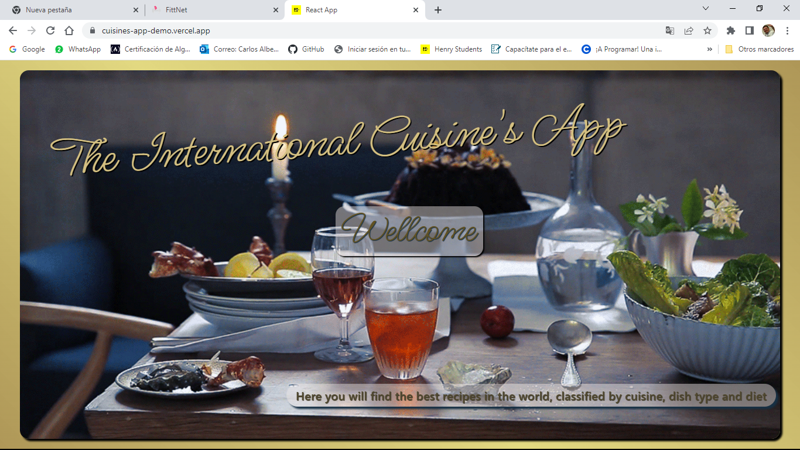
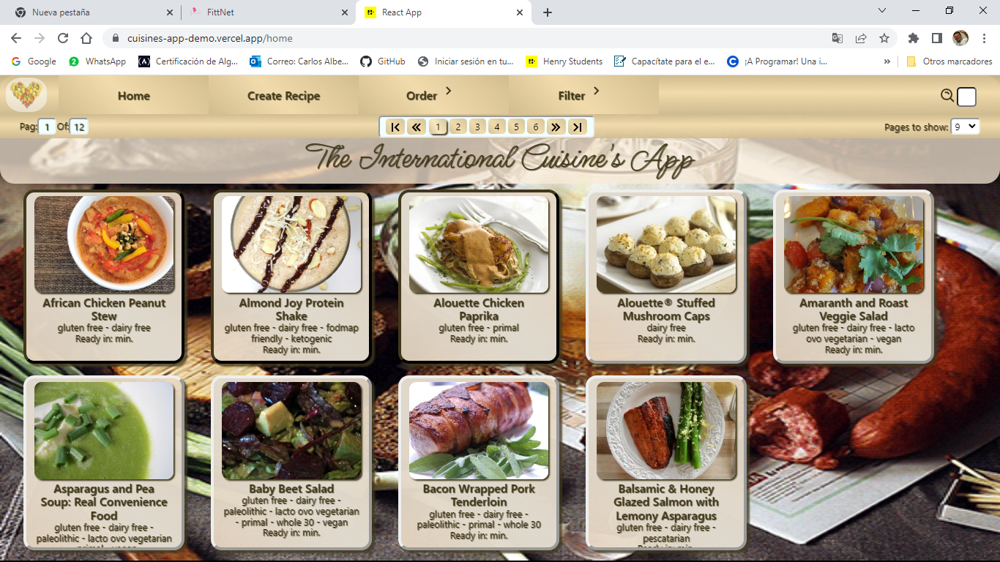

    

<!--  -->
### Hi there 👋 my name is Carlos Acevedo and this is my profile.

## Full Stack Develop || JavaScript, React, Express, NodeJs

I would describe myself as a tireless worker, I have worked since I was 17 years old in multiple jobs,
highlighting my work as an educator, and head of an IT department in the public sector of my country for more than 10 years from 1992 to 2009. 
Later I ventured into the business world, starting my own company dedicated to computer networks and sales of computers and related services for more than 6 years. 
Subsequently, I dedicated myself to the sales business where I've worked in real estates and in the Clean Energies sector as a seller of Solar Panels and real estate for various companies until a couple of months ago when I decide to enter to renew my knowledge in programming at Henry school. 
I've always liked programming environments and languages and at some point during the time that I had my business I also dabbled in making a couple of basic web pages with HTML and flash, currently I have finished Henry's course graduating as Full Stack Develop, learning about the new technologies that today make the difference in this area. 
I have learned and remembered my basics in programming through languages ​​and programs like Node js, JavaScript, React, Redux, Express, databases and handlers like sequelize, postgress, mongoDB, and mongoose among many others. 
Furthermore, I have the responsibility of supporting a family and a son who will soon follow in my footsteps by entering the world of programming, since he has decided to study his systems engineering at the Autonomous University of Yucatan, so having and keeping a job in this environment is my priority. 

## Skills.

Front End: JavaScript ["ReactJs", "Redux", "Leaflet", "react-chartjs-2", "sweetalert2", "scroll-motion", "google-login"]

Back End: JavaScript ["Express", "Sequelize", "NodeJs", "PostgreSQL", "MongoDB", "Mongoose", "Passport"]

    

## Professional Experience

    
     This was the first logo I made for mi first company

###Proyecto Fittnet:
    Description: A web app developed to provide a platform for users and owners of gyms, which allows them to get closer to each other.
    For the owners of one or several gyms, it provides them with a platform to exhibit their services and manage their income.
    Likewise, for the users of these services, it provides a showcase, where they can find opinions of the services, as well as searches by proximity or rating or price, as well as a way to pay for these services online.
    
 Tecnologies Used:
🎖️FrontEnd: "ReactJs", "Redux", "Leaflet", "react-chartjs-2", "sweetalert2", "scroll-motion", "google-login", "CSS modules".
🎖️BackEnd and Data Base: "Express", "NodeJs", "MongoDB", "Mongoose", "Passport" 
🎖️Stripe was used for service purchases and for purchases of plans for partner users we used Mercadopago.

For this project I worked both in the Back end and in the front part, developing both half of the back routes and the components used for graphics and maps in the front; it was also my job to build the template used using express for the server and react redux for the app.

For the deploy of this app you can click <a href=”https://fittnet-g11.vercel.app/” target=”_blank”>here</a> 
or in any of the following images.

  
  
  

  
  
  
  

  
  
  
  

###Proyecto The International Cuisine's App:
    Description: A single page aplication, It was made for one of the final stages of bootcamp henry as my individual proyect.
    This app allows users to search, sort and filter cooking recipes as well as create their own recipes.
    
 Tecnologies Used:
🎖️FrontEnd: "ReactJs", "Redux", "CSS3".
🎖️BackEnd and Data Base: "Express", "NodeJs", "Sequelize", "PostgreSQL" 

For the deploy of this app you can click <a href=”https://cuisines-app-demo.vercel.app/” target=”_blank”>here</a> 
or in any of the following images.

  
  
  

#Contact Me:

If you liked what you saw and want to contact me for a job offer, to help you create the page of your dreams or simply to compare code, you can find me following the next links.

  
  
